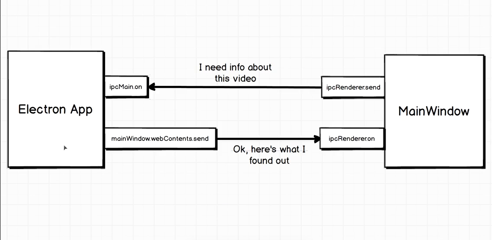

# Electron App Beginner

An electron app that will help understand the basics of electron, its syntax, and workflow. <br>
This app illustrates the way electron app is built and handles communication. How it uses IPC(Inter Process Communication) to fetch the length of video using fluent-ffmpeg which is a node js library.

## Getting Started

1. Install npm (if not):

    ```bash
    sudo apt install npm
    ```

2. Install dependencies:

    ```bash
    cd electronvideoinfo
    npm init
    npm install --save electron
    sudo apt install ffmpeg
    npm install --save fluent-ffmpeg
    ```

3. Add electron script to package.json. Replace the existing script code to:
    
    ```json
    "scripts": {
    "electron": "electron ."
    }
    ```

4. Run app:

    ```bash
    npm run electron
    ```
## Understanding the IPC (Inter Process Communication)


